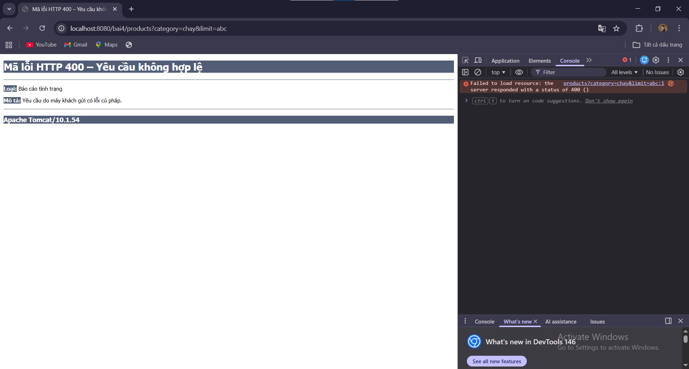

URL: /bai4/products?category=chay&limit=10

Dữ liệu vào:
- category (String) từ RequestParam
- limit (int) từ RequestParam

Controller:
- Nhận category, limit
- Đưa vào ModelMap với key:
    + "category"
    + "limit"
    + "message"

View:
- Tên file: productList.jsp
- Hiển thị bằng:
  ${category}
  ${limit}
  ${message}

Test lỗi: http://localhost:8080/bai4/products?category=chay&limit=abc

Do biến limit khai báo kiểu int nhưng người dùng truyền "abc" (String),
Spring không thể ép kiểu nên xảy ra lỗi Type Mismatch và trả về 400 Bad Request.